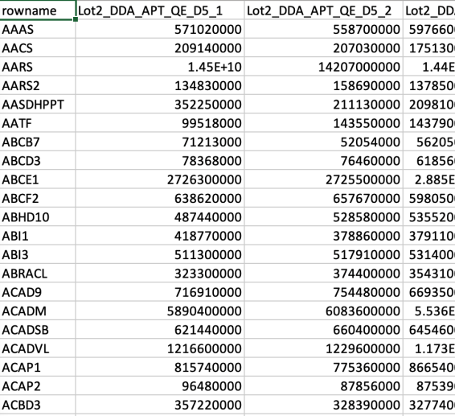

From Quantified Expression Profiles to QC Report

!!! note 
    You can find the source code on [chinese-quartet/quartet-protqc-report](https://github.com/chinese-quartet/quartet-protqc-report.git)

## Prepare data & metadata files

### Data File

The data file contains gene symbols of each protein and its quantitated expression level in each sample (replicate), and the missing values are allowed. The required file format has samples in columns and a column named "rowname". 

A screenshot of a sample data table is shown below.

{ width="70%" }

### Metadata File

The metadata file has the information of each sample in the data file. With columns named "name", "sample" (D5, D6, F7 and M8 for Quartet samples). Remember that the column "name" and column names of the data file table must be in one-to-one correspondence. 

A screenshot of a sample metadata table is shown below.

{ width="50%" }

## Step by Step Guide

### Analyze your data on your own server

1. Pull docker image 

    More versions on [Docker Registry](https://github.com/chinese-quartet/quartet-protqc-report/pkgs/container/quartet-protqc-report)

    ```
    docker pull ghcr.io/chinese-quartet/quartet-protqc-report:v0.2.2-27439957
    ```

2. Run quartet-protqc-report with docker image

    Assuming that your data file is named `data.csv` and metadata file is named `metadata.csv` and all files are placed in `/your-dir` directory.

    ```
    docker run -v /your-dir:/data -it ghcr.io/chinese-quartet/quartet-protqc-report:v0.2.2-27439957 -d /data/data.csv -m /data/metadata.csv -o /data
    ```

3. Find your QC report in `/your-dir/multiqc_report.html`

### Analyze your data on Quartet Data Portal

As for running the QC pipeline of proteomics data, you can:

1) go to [http://chinese-quartet.org/#/seq-flow/protqc-report-management](http://chinese-quartet.org/#/seq-flow/protqc-report-management);

2) click the upper right button named "New QC report";

3) click "Step 1: Choose Report", please choose "QC Report for Quartet Proteomics" ;

4) click "Step 2: Upload Files (s)", please upload your data and metadata files (.csv). 

5) click "Step 3: Parameters & Submit", please fill in the blanks and submit the job.

See more details on [Step by Step Guide](../../getting_started/step_by_step_guide_protein.md)

### More details about QC metrics

The package protqc output Quality Control(QC) results of proteomics data for Quartet Project. The QC pipeline starts from the expression profiles at peptide/protein levels, and enables to calculate 6 metrics. A Total score is the geometric mean of the linearly normalized values of these metrics.

1. ***Number of features***: We expect as many proteins (mapped to gene symbols) as possible for downstreaming analyses.

2. ***Missing percentage (%)***: Too many missing values interfere with comparability. This metric is calculated globally.

3. ***Coefficient of variantion (CV, %)***: A CV value is calculated to indicate the dispersion within replicates feature by feature.

4. ***Absolute Correlation***: Pearson correlation reflects overall reproducibility within replicates. We calculate correlation coefficients between each two replicates within each biological sample (D5, D6, F7, M8), and take the median as the final value for absolute correlation.

5. ***Signal-to-Noise Ratio (SNR)***: SNR is established to characterize the ability of a platform or lab or batch, which is able to distinguish intrinsic differences among distinct biological sample groups (“signal”) from variations in technical replicates of the same sample group ("noise").

6. ***Relative Correlation with Reference Datasets (RC)***: RC is used for assessment of quantitative consistency with the reference dataset at relative levels. For shotgun proteomics, quantitation at peptide levels is theoretically more reliable. Therefore, the reference dataset is established by benchmarking the relative expression values (log2FCs), for each peptide sequence of each sample pair (D5/D6, F7/D6, M8/D6), in historical datasets at peptide levels. We calculate relatively qualified (satisfied with thresholds of p < 0.05) log2FCs of the queried data, for overlapped peptides with the reference dataset, as the input for the assessment of quantitative consistency. Then RC value is Pearson correlation coefficient between the test dataset and the reference dataset.
