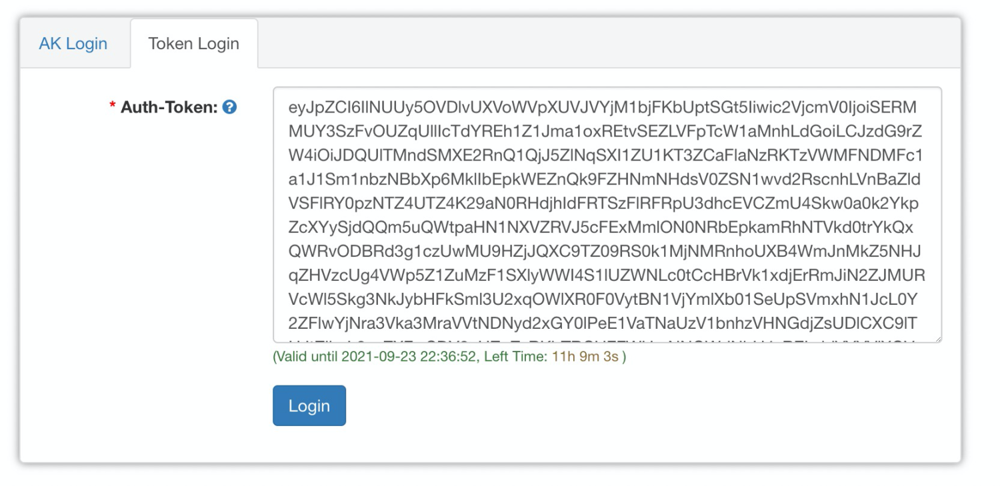

`ossbrowser` is a graphical management tool to upload data to the Quartet Data Portal.

| Name        | Recommendation | Notice                                                                                                     | Category | Characteristics               | Expected Average Speed |
| ----------- | -------------- | ---------------------------------------------------------------------------------------------------------- | -------- | ----------------------------- | ---------------------- |
| OSS Browser | Low            | Only use it when the total data volume is less than 100GB and the size of one single file is less than 5GB | GUI Tool | Easy, but slower than OSSUtil | 1-30MB/s               |

#### 1. Download and installation
The ossbrowser supports the following operating systems: Windows, Linux, and macOS. You can download and install the ossbrowser version that best suits your requirements. 

- Click [here](https://www.alibabacloud.com/help/en/object-storage-service/latest/install-and-log-on-to-ossbrowser) to download ossbrowser and see more details.

#### 2. Log on to ossbrowser
You will get the AccessKeyId (accessKey), AccessKeySecret (accessSecret), STS Token (stsToken), Preset Oss Path (uploadPath), and Auth-Token (authorizedCode) from data.json which is generated by clicking "New Token" button in Quartet Data portal website.

  The contents of the data.json file are as follows:

  ```
  {
    "uploadPath": "oss://quartet-data-portal/data/your@email.address/transcriptomics/",
    "region": "oss-cn-shanghai",
    "durationHours": 12,
    "expiration": "Thu Sep 23 2021 22:02:21 GMT+0800",
    "accessKey": "STS.NSw4TPayxZcbeXQbDfoZiHE16",
    "accessSecret": "38DvQmDt7o7jkrtGXEakjXJMXvoAhYF4cKsGJUaX9Lhz",
    "stsToken": "CAIS2wR1q6Ft5B2yfSjIr5DCf+7kjKZZ7aGJZ37ghkQzY9VFp4Ca1Dz2IHlJdXFgBOEdsf4wlWFR7/wdlrxKVpZfWUHYQcJs56xQ6x+oZ7DGv8HtHWi3dzTiSwapEBfe8JL4kI6bJYqv2J7PBnnAkihsu5uYERypQ12iN7CQlJdjda55dwKkbD1Ado80Qwx5s501OGf2P/SgOQKI523LFxhQpxZbg2Fy4rjdusqH8UjygVn31uIyrYb8KYTecKsKBppkVMqv1+Fbb7fI1DUqiyJH76BrlqdJiwSlj9iWGAtW+A7UcbiWoMRyJRVla7R/F6dYpb3kkudks+iUm43rwlFcIOxMUi3ZS5unxsTsFv6lP9B/eLrmfX/LleqpH67pvhg4Jm4BPQVRcMAgMmN3DB0nUXaYWA/Omj3jZgOkVNLEssUf2oZ0yFPF5MeDI0P1LZySzScfPO1FDSQvLAVE+W36bogMcQFHb0gdUtTzd4hoaw1Eoq7FpBDbUjYarktapPrjffjbyOl9Hoz0RcBBypFPJsYE4XI3Rk7rRq7rhk4IfSl9RqxK2a2XBP3d06OfweOcRe/FB4plvU5BIwjLoiSMWQEDT3z978EqLkuF9t3QxarD6JRmHyMg+9xWC0eIfcsrpFoh2Y2b2Aie6/OkTmqj+HEz4NjA445K6EB/ObWG+7bK52CF4CbIPvlowJaPBTVVLE7pKyAj8pe7nWkaoh0NqWawNisE5k6ZvWTKJ5RGg6TbmyIfXf0MyLWBEm3/5Bh5FNuT/7sXVep+dfhJSOq12RtuwvD3PaENd1wiPn4agAEagz7gU9EpH9fkAUugKbeH9H8ph22NrWAu8WUQF5PPi9CnqP1itUkdDtaTTprv4E5zD3RyWiYH9yA5jn9pYjwvj1tSBXjOCrIo/MLx0DGVSTZ6yExb+SYPNKzaWQ1rloPtKqGWOcXNCOgvYiy8U21Hw8UVzO7EErVAuPvlDNdqWg==",
    "authorizedCode": "eyJpZCI6IlNUUy5OU3c0VFBheXhaY2JlWFFiRGZvWmlIRTE2Iiwic2VjcmV0IjoiMzhEdlFtRHQ3bzdqa3J0R1hFYWtqWEpNWHZvQWhZRjRjS3NHSlVhWDlMaHoiLCJzdG9rZW4iOiJDQUlTMndSMXE2RnQ1QjJ5ZlNqSXI1RENmKzdraktaWjdhR0paMzdnaGtRelk5VkZwNENhMUR6MklIbEpkWEZnQk9FZHNmNHdsV0ZSN1wvd2RscnhLVnBaZldVSFlRY0pzNTZ4UTZ4K29aN0RHdjhIdEhXaTNkelRpU3dhcEVCZmU4Skw0a0k2YkpZcXYySjdQQm5uQWtpaHN1NXVZRVJ5cFExMmlON0NRbEpkamRhNTVkd0trYkQxQWRvODBRd3g1czUwMU9HZjJQXC9TZ09RS0k1MjNMRnhoUXB4WmJnMkZ5NHJqZHVzcUg4VWp5Z1ZuMzF1SXlyWWI4S1lUZWNLc0tCcHBrVk1xdjErRmJiN2ZJMURVcWl5Skg3NkJybHFkSml3U2xqOWlXR0F0VytBN1VjYmlXb01SeUpSVmxhN1JcL0Y2ZFlwYjNra3Vka3MraVVtNDNyd2xGY0lPeE1VaTNaUzV1bnhzVHNGdjZsUDlCXC9lTHJtZlhcL0xsZXFwSDY3cHZoZzRKbTRCUFFWUmNNQWdNbU4zREIwblVYYVlXQVwvT21qM2paZ09rVk5MRXNzVWYyb1oweUZQRjVNZURJMFAxTFp5U3pTY2ZQTzFGRFNRdkxBVkUrVzM2Ym9nTWNRRkhiMGdkVXRUemQ0aG9hdzFFb3E3RnBCRGJVallhcmt0YXBQcmpmZmpieU9sOUhvejBSY0JCeXBGUEpzWUU0WEkzUms3clJxN3JoazRJZlNsOVJxeEsyYTJYQlAzZDA2T2Z3ZU9jUmVcL0ZCNHBsdlU1Qkl3akxvaVNNV1FFRFQzejk3OEVxTGt1Rjl0M1F4YXJENkpSbUh5TWcrOXhXQzBlSWZjc3JwRm9oMlkyYjJBaWU2XC9Pa1RtcWorSEV6NE5qQTQ0NUs2RUJcL09iV0crN2JLNTJDRjRDYklQdmxvd0phUEJUVlZMRTdwS3lBajhwZTduV2thb2gwTnFXYXdOaXNFNWs2WnZXVEtKNVJHZzZUYm15SWZYZjBNeUxXQkVtM1wvNUJoNUZOdVRcLzdzWFZlcCtkZmhKU09xMTJSdHV3dkQzUGFFTmQxd2lQbjRhZ0FFYWd6N2dVOUVwSDlma0FVdWdLYmVIOUg4cGgyMk5yV0F1OFdVUUY1UFBpOUNucVAxaXRVa2REdGFUVHBydjRFNXpEM1J5V2lZSDl5QTVqbjlwWWp3dmoxdFNCWGpPQ3JJb1wvTUx4MERHVlNUWjZ5RXhiK1NZUE5LemFXUTFybG9QdEtxR1dPY1hOQ09ndllpeThVMjFIdzhVVnpPN0VFclZBdVB2bEROZHFXZz09IiwicHJpdmlsZWdlIjoiUmVhZC1Xcml0ZSIsImV4cGlyYXRpb24iOiIyMDIxLTA5LTIzVDE0OjAyOjIxWiIsIm9zc3BhdGgiOiJvc3M6XC9cL3F1YXJ0ZXQtZGF0YS1wb3J0YWxcL2RhdGFcL3l1ZXFpYW5nc29uZ0BmdWRhbi5lZHUuY25cL1JOQV90ZXN0XC90cmFuc2NyaXB0b21pY3NcLyIsInJlZ2lvbiI6Im9zcy1jbi1zaGFuZ2hhaSIsImR1cmF0aW9uX3NlY29uZHMiOjQzMjAwfQ=="
  }
  ```

There are two methods to log on to ossbrowser, AK Login and Token Login.

a. **AK Login**

You need to fill in the AccessKeyId (accessKey), AccessKeySecret (accessSecret), STS Token (stsToken), and Preset Oss Path (uploadPath) as follows:


b. **Token Login**

You need to fill in the Auth-Token (authorizedCode) as follows:



Then, you will see the following screen：


#### 3. Click "Upload" to upload files

- You can click "Upload" button to upload your omics data files and metadata files, and then verify and confirm uploaded files by clicking "Check" button in Quartet Data portal website.

- You only have 12 duration hours, please upload as soon as possible.
